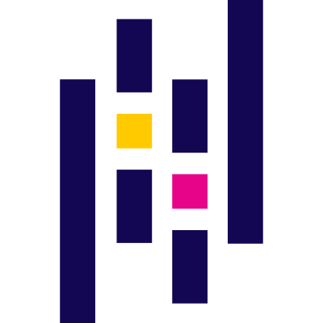

<h1 align="center">Hi 👋, I'm Hardik Jasani</h1>
<h3 align="center">  🧑‍💻 Software Developer in Test | DevOps Specialist | MLOps Enthusiast | GenAI Explorer </h3>
<h3 align="center">  💡 Interests: Web, APIs, DevOps, Automation, Cloud, Docker, K8 </h3>
<h3 align="center">  📍 Based in Calgary, Alberta, Canada  </h3>

  

  

  

<h2>🔭 Current Work</h2>

Currently working on <strong>web automation</strong> and <strong>DevOps pipelines</strong> with a focus on efficiency, scalability, and cutting-edge technologies.

<ul>
  <li><strong>Web Automation:</strong> Selenium, Cypress, Playwright, Python, PyTest</li>
  <li><strong>CI/CD & DevOps:</strong> Jenkins, GitHub Actions, CircleCI</li>
  <li><strong>Cloud & Containerization:</strong> Docker, Kubernetes, AWS, GCP, Azure</li>
</ul>

<h2>🌱 Learning & Exploring</h2>

<ul>
  <li>MLOps pipelines, AI/ML integration, and GenAI applications</li>
  <li>Scalable DevOps & cloud solutions</li>
</ul>

<h2>👯 Collaboration Interests</h2>

<ul>
  <li>Software automation & testing</li>
  <li>DevOps/MLOps workflows</li>
  <li>AI-powered tools & innovative tech solutions</li>
</ul>

- 📫 How to reach me **jasanih382@gmail.com**

<h3 align="left">Connect with me:</h3>

## 🧰 Languages & Tools

<table align="center">
  <tr>
    <td align="center">
       Python
    </td>
    <td align="center">
       Pandas
    </td>
    <td align="center">
       Docker
    </td>
    <td align="center">
       Kubernetes
    </td>
    <td align="center">
       Linux
    </td>
    <td align="center">
       Bash
    </td>
    <td align="center">
       Grafana
    </td>
    <td align="center">
       Prometheus
    </td>
    <td align="center">
       Terraform
    </td>
  </tr>

  <tr>
    <td align="center">
       MLflow
    </td>
    <td align="center">
       PyTorch
    </td>
    <td align="center">
       TensorFlow
    </td>
    <td align="center">
       Perl
    </td>
    <td align="center">
       Jenkins
    </td>
    <td align="center">
       Git
    </td>
    <td align="center">
       Postman
    </td>
    <td align="center">
       GitHub Actions
    </td>
    <td align="center">
       CircleCI
    </td>
  </tr>

  <tr>
    <td align="center">
       Selenium
    </td>
    <td align="center">
       Pytest
    </td>
    <td align="center">
       Playwright
    </td>
    <td align="center">
       Cucumber
    </td>
    <td align="center">
       Android
    </td>
    <td align="center">
       AWS
    </td>
    <td align="center">
       Azure
    </td>
    <td align="center">
       Firebase
    </td>
    <td align="center">
       GCP
    </td>
  </tr>

  <tr>
    <td align="center">
       Java
    </td>
    <td align="center">
       MySQL
    </td>
    <td align="center">
       PostgreSQL
    </td>
    <td align="center">
       Redis
    </td>
  </tr>
</table>

  <!-- Top Languages Used -->
  

  <!-- Total Contributions -->
  

  <!-- Streak or Recent Activity -->
  

